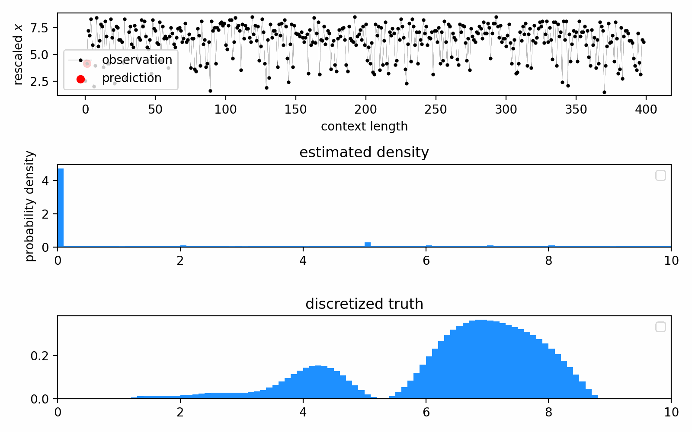
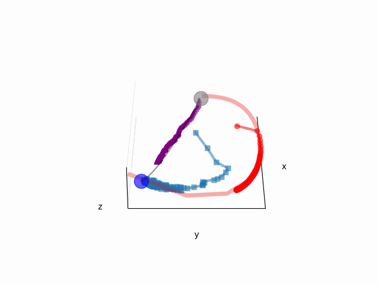
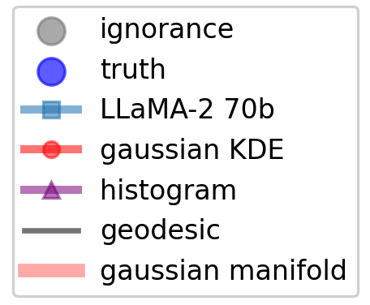

## LLMICL InPCA
This repository contains the complementary codebase for the paper: 
    [Density estimation with LLMs: a geometric investigation of in-context learning trajectories](https://arxiv.org/abs/2410.05218)

*LLaMA-2 70B estimating a randomly generated, multi-modal distribution from 400 data points*

  
  

*In-context density-estimation trajectories traversed by LLaMA-2 70B, Bayesian histogram, and kernel density estimator*

## Directory structure

- `/data`: Contains functions for converting lists of sampled data $X_1,X_2,...,X_n \sim P(x)$ into 1D strings, which are then used to prompt LLMs.
It contains `series_generator.ipynb`, a Jupyter notebook for generating all distributions investigated in the paper: Gaussian, uniform, Student's t-distribution, and random PDFs.

- `/generated_series`: This directory caches all prompts generated by `series_generator.ipynb` in the form of pickled dictionaries.

- `/models`: 
    - `ICL.py` implements essential packages like Hierarchy-PDF and its auxiliary functions. 
    - `generate_predictions.py` prompts LLMs such as LLaMA, Mistral, and Gemma with the generated prompts and saves the estimated PDFs as pickled Hierarchy-PDFs.
    - `baseline_models.py` implements baseline density-estimation algorithms such as KDE and Bayesian histogram.

- `/processed_series`: Stores the density estimation trajectories of LLMs.

- `/inPCA`: Contains Jupyter notebooks for analyzing LLMs' DE trajectories with InPCA:
    - `inPCA_multi_traj.ipynb` simultaneously embeds multiple DE trajectories within the same inPCA visualization.
    - `inPCA_multi_traj_kernel_nD_fit.ipynb` simultaneously embeds multiple DE trajectories, as well as their bespoke KDE trajectories.
    - `inPCA_multi_traj_kernel_nD_fit_meta_embed.ipynb` 
    performs meta-inPCA embeddings of multiple trajectories and their bespoke KDE imitations.

- `/figures`: A repository for all figures generated through the analysis processes.